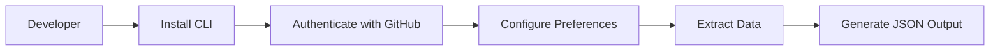
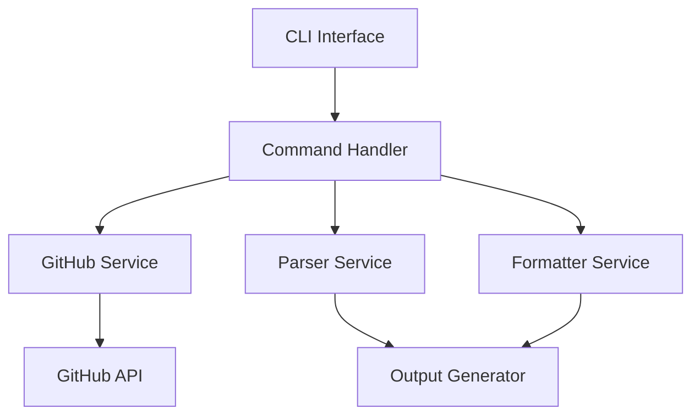

### 1. Core Purpose
GitFolio-Extract will help developers:
- Extract their GitHub projects' information
- Generate structured data for portfolio websites
- Save time on portfolio maintenance

### 2. User Experience Flow


### 3. Feature Tiers

**Tier 1 (MVP)**
- Basic repository information extraction
  - Name, description, URL
  - Languages used
  - Stars and forks
  - Last updated date
  - README content
- Simple JSON output
- Basic CLI commands
- Tech stack detection from:
  - package.json
  - requirements.txt
  - gemfile
  - etc.

**Tier 2**

- Repository filtering options
- Custom output templates
- Cache support for faster subsequent runs

**Tier 3**
- Project screenshots (from README)
- Repository statistics and analytics
- Multiple output formats (JSON, YAML, MD)
- Custom data enrichment

### 4. Technical Architecture



### 5. Core Components

1. **CLI Interface**
   - Command parsing
   - User input handling
   - Progress display
   - Error handling

2. **GitHub Service**
   - API authentication
   - Repository fetching
   - Rate limit handling
   - Data caching

3. **Parser Service**
   - README parsing
   - Tech stack detection
   - Metadata extraction
   - Content analysis

4. **Formatter Service**
   - Data structuring
   - Template processing
   - Output generation

### 6. Configuration Options

```typescript
interface Config {
  // GitHub Authentication
  githubToken?: string;
  
  // Repository Filters
  includePrivate: boolean;
  includeForked: boolean;
  excludeRepos: string[];
  
  // Output Options
  outputFormat: 'json' | 'yaml' | 'md';
  outputPath: string;
  
  // Content Options
  includeReadme: boolean;
  includeTechStack: boolean;
  includeStats: boolean;
}
```

### 7. Sample Output Structure

```json
{
  "metadata": {
    "generated": "timestamp",
    "username": "string",
    "totalRepos": "number"
  },
  "repositories": [
    {
      "basic": {
        "name": "string",
        "description": "string",
        "url": "string",
        "homepage": "string"
      },
      "stats": {
        "stars": "number",
        "forks": "number",
        "lastUpdated": "date"
      },
      "technical": {
        "languages": ["string"],
        "techStack": ["string"],
        "topics": ["string"]
      },
      "content": {
        "readme": "string",
        "features": ["string"]
      }
    }
  ]
}
```

### 8. Development Phases

1. **Phase 1: Foundation**
   - Basic CLI setup
   - GitHub API integration
   - Simple JSON output

2. **Phase 2: Core Features**
   - README parsing
   - Tech stack detection
   - Basic filtering

3. **Phase 3: Enhancement**
   - Caching
   - Multiple output formats
   - Advanced filtering

### Questions to Consider:
